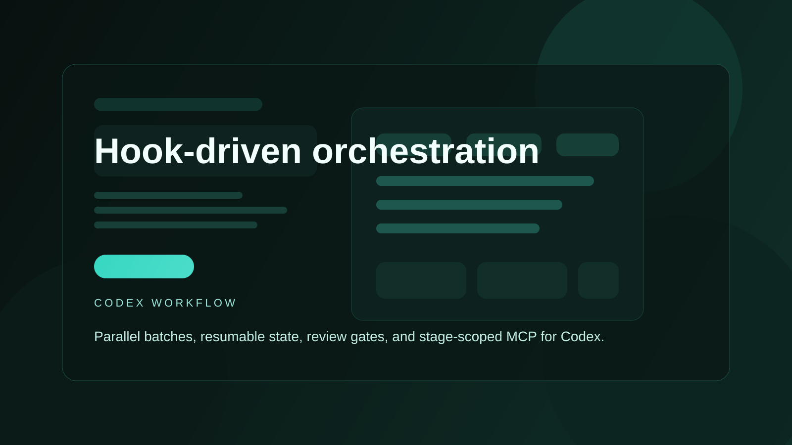
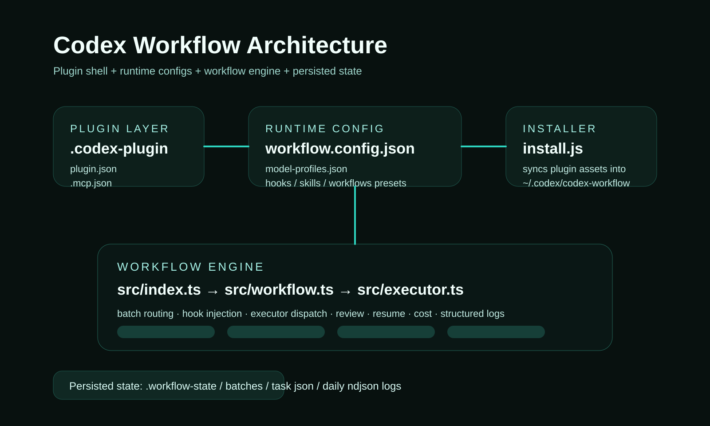

# Codex Workflow

> Hook-driven workflow orchestration for Codex with parallel batches, CLI workers, review gates, and resumable runs.


<p align="center"><b>English</b> | <a href="README.md"><b>中文</b></a></p>

<p align="center">
  
</p>

**Codex Workflow** turns one-off prompting into a reusable execution pipeline.
It is designed for routing different task types to different executors, inserting hooks and skills around dispatch, gating completion with review, and preserving task / batch state for repeatable work.

---

## Why It Exists

Codex is strong at focused execution, but recurring project work usually needs more structure around it:

- different tasks should go to different executors
- some outputs need review gates before they count as done
- batch runs need logs, summaries, and restartability
- workflow rules should be reusable instead of re-prompted every time

Codex Workflow provides that layer without requiring a separate orchestration service.

---

## Core Capabilities

| Capability | What it does |
|------|------|
| Parallel batch execution | Run multiple goals in serial or parallel with `maxParallel` control |
| Auto routing | Assign executor, role, and complexity from `model-profiles.json` |
| Hook pipeline | Apply `task:before_dispatch`, `task:after_result`, and `review:after` |
| Resumable runs | Retry only unfinished tasks with `run-batch --resume <batch-id>` |
| Review loop | Accept, reject, retry, or block worker output before finalizing |
| Structured logs | Write NDJSON logs into `.workflow-state/logs/` |
| Cost estimation | Summarize estimated token and cost usage from routed task profiles |
| Mixed execution modes | Switch between external CLI workers and Codex-managed handling |

---

## Runtime Model

<p align="center">
  
</p>

Execution flow:

1. Accept one goal or a batch of goals
2. Optionally auto-route each task
3. Apply dispatch hooks and inject skills
4. Run the executor
5. Review the result
6. Apply after-result and review-after hooks
7. Save task state, batch summary, logs, and estimated cost
8. Resume later if the batch was interrupted

---

## Installation

There are two separate steps:

1. **Get the repository locally**
2. **Install the current repository contents into your local Codex home**

The current `npm run install-plugin` only covers step 2, meaning installation from a local checked-out repository.  
If users do not want to clone first, they can use the remote installer below.

### Standard local install flow

```bash
git clone https://github.com/kialajin-l/codex-workflow.git
cd codex-workflow
npm install
npm run build
npm run install-plugin
```

`install.js` syncs repository assets into local `~/.codex/`:

- `SKILL.md` -> `~/.codex/skills/codex-workflow/`
- `agents/`
- `hooks/`
- `skills/`
- `workflows/`

It also ensures:

- `~/.codex/codex-workflow/workflows/pdca-default.json`
- `~/.codex/codex-workflow/runtime/`
- `~/.codex/codex-workflow/bin/`

### What this repo supports today

- local source install
- local build
- local sync into Codex directories

### Remote install

The repository now includes remote install scripts.

PowerShell:

```powershell
irm https://raw.githubusercontent.com/kialajin-l/Codex-Workflow/main/install.ps1 | iex
```

Bash:

```bash
curl -fsSL https://raw.githubusercontent.com/kialajin-l/Codex-Workflow/main/install.sh | bash
```

The remote installer will:

1. download the source from GitHub
2. run `npm install`
3. run `npm run build`
4. prune dev dependencies
5. call `install.js` to sync into local `~/.codex/`

### Installed CLI locations

After installation, the runtime and wrappers are placed at:

- `~/.codex/codex-workflow/runtime/`
- `~/.codex/codex-workflow/bin/`

Windows:

- `~/.codex/codex-workflow/bin/cwf.cmd`
- `~/.codex/codex-workflow/bin/cwf.ps1`

macOS / Linux:

- `~/.codex/codex-workflow/bin/cwf`

### How to run it after installation

If you installed through the remote scripts, use the wrapper directly:

Windows PowerShell:

```powershell
& $HOME\.codex\codex-workflow\bin\cwf.ps1 init
```

Windows CMD:

```bat
%USERPROFILE%\.codex\codex-workflow\bin\cwf.cmd init
```

macOS / Linux:

```bash
~/.codex/codex-workflow/bin/cwf init
```

---

## Quick Start

### 1. Initialize runtime state

```bash
node dist/index.js init
```

This creates `.workflow-state/` for task, batch, probe, and log files.

If you installed with the remote installer, run:

```bash
cwf init
```

### 2. Probe your executors

```bash
node dist/index.js probe
node dist/index.js probe --executor opencode-serve --auto
```

Probe before real batch execution so executor behavior is known-good.

Remote-install equivalents:

```bash
cwf probe
cwf probe --executor opencode-serve --auto
```

### 3. Run a batch

```bash
node dist/index.js run-batch --goals "Implement hello,Review login" --mode parallel --auto-route
```

Outputs:

- `stdout`: full batch JSON
- `stderr`: human-readable summary with completion count, blocked count, elapsed time, and estimated cost

Remote-install equivalent:

```bash
cwf run-batch --goals "Implement hello,Review login" --mode parallel --auto-route
```

### 4. Resume unfinished work

```bash
node dist/index.js run-batch --resume <batch-id>
```

Only tasks that are neither `completed` nor `blocked` are retried.

Remote-install equivalent:

```bash
cwf run-batch --resume <batch-id>
```

---

## Common Commands

| Command | Purpose |
|------|------|
| `node dist/index.js init` | Create `.workflow-state` |
| `node dist/index.js run --goal "..."` | Run one task |
| `node dist/index.js run-batch --goals "a,b,c"` | Run a batch |
| `node dist/index.js run-batch --goals "..." --auto-route` | Run with profile routing |
| `node dist/index.js run-batch --resume <batch-id>` | Resume a batch |
| `node dist/index.js status --id <task-id>` | Show task status |
| `node dist/index.js status --batch <batch-id>` | Show batch status |
| `node dist/index.js probe --executor <name>` | Probe one executor |
| `node dist/index.js workflow-save --name <name>` | Save current workflow preset |
| `node dist/index.js workflow-load --name <name>` | Load a workflow preset |
| `node dist/index.js workflow-list` | List presets |

After remote installation, you can replace `node dist/index.js` with `cwf` for the commands above.

---

## Plugin Entrypoints

Current standard entrypoints:

- [`.codex-plugin/plugin.json`](./.codex-plugin/plugin.json)
- [`.mcp.json`](./.mcp.json)

Presentation assets:

- [`assets/`](./assets/)
- [`docs/assets/`](./docs/assets/)

---

## Project Structure

```text
codex-workflow/
├── .codex-plugin/              # Codex plugin manifest
├── .mcp.json                   # MCP server config
├── assets/                     # plugin icon, logo, screenshots
├── docs/                       # user and maintainer docs
├── agents/                     # bundled agent assets
├── hooks/                      # default hook configs
├── skills/                     # injectable skill fragments
├── workflows/                  # workflow presets
├── src/                        # CLI and runtime implementation
├── workflow.config.json        # executor and concurrency config
├── model-profiles.json         # routing and cost profiles
└── install.js                  # local installer
```

---

## Customization

In most cases, change configuration before changing runtime code.

Recommended order:

1. `workflow.config.json`
2. `hooks/*.json`
3. `workflows/*.json`

Start here:

- [Getting Started](./docs/getting-started.md)
- [Customizing Workflows](./docs/customizing-workflows.md)
- [Hooks Reference](./docs/hooks-reference.md)
- [Plugin Structure](./docs/plugin-structure.md)

---

## Current Scope

Implemented:

- spawn executor flow
- serve executor flow
- batch, probe, polling, and summary features
- hook-driven routing and stage scoping
- delegated Codex handling path
- cost tracking, timeout unification, resume support, and NDJSON logging

Still worth hardening:

- automated tests for `resume`, hook pipeline behavior, logger output, and cost summaries
- more polished screenshots and marketplace-facing copy
- a first-user remote installer

---

## Contributing

```bash
git clone https://github.com/kialajin-l/codex-workflow.git
cd codex-workflow
npm install
npm run build
```

If you want to evolve workflow behavior, read the docs first and change config before runtime internals.

---

## License

[MIT](./LICENSE)
